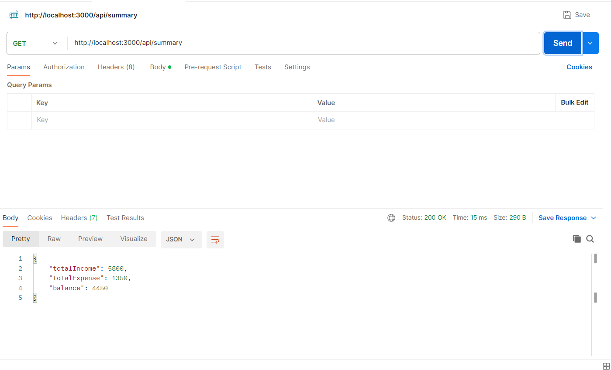
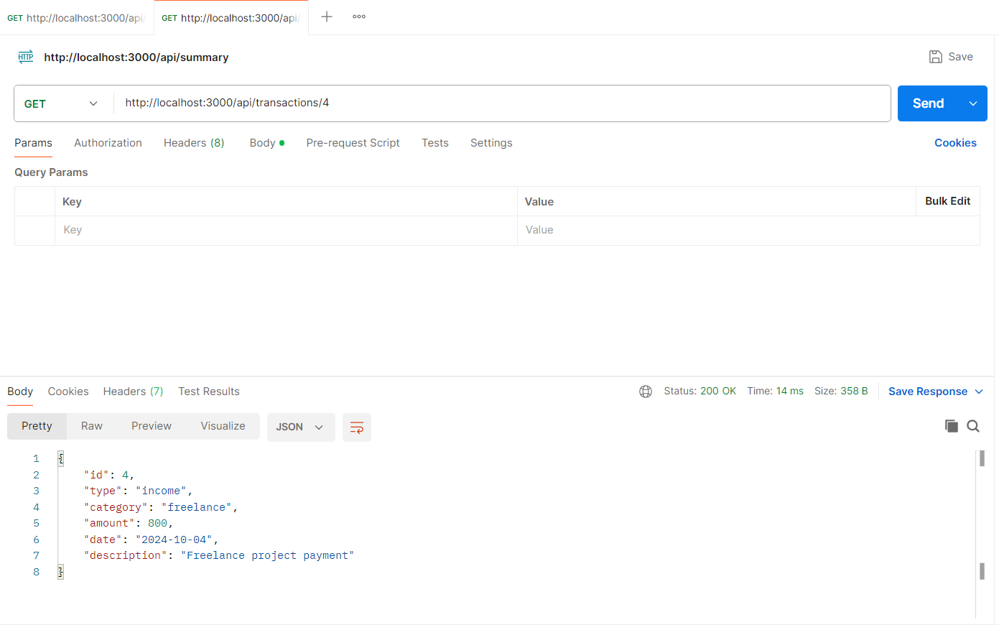
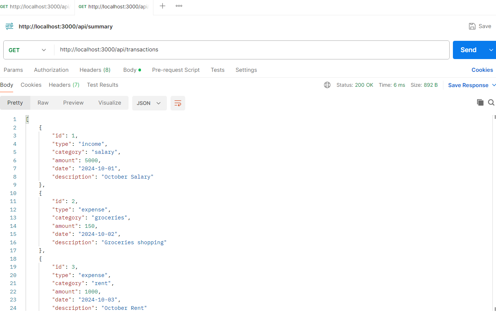
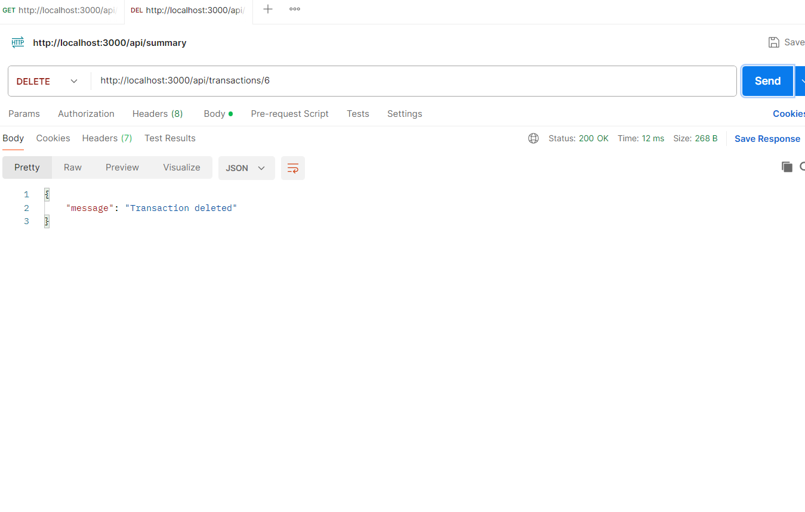
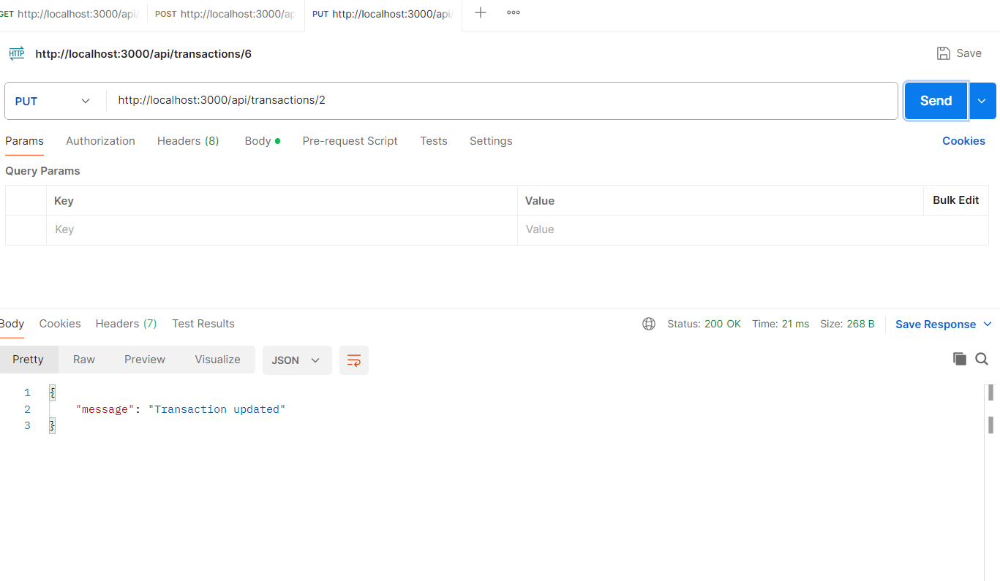
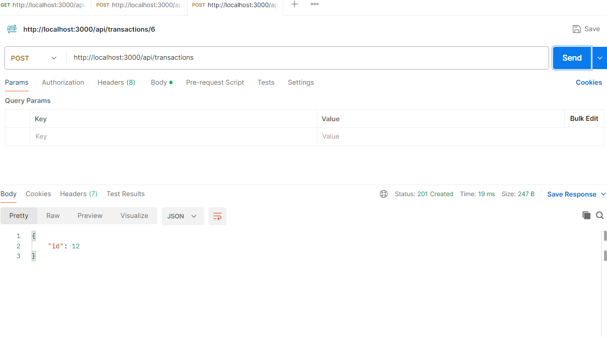

# Personal Expense Tracker API

This is a RESTful API for managing personal financial records, such as incomes and expenses. Users can record their transactions, retrieve past transactions, and get summaries by category or time period.

## Table of Contents

- [Features](#features)
- [Technologies Used](#technologies-used)
- [Setup Instructions](#setup-instructions)
- [API Endpoints](#api-endpoints)
  - [POST /api/transactions](#post-apitransactions)
  - [GET /api/transactions](#get-apitransactions)
  - [GET /api/transactions/:id](#get-apitransactionsid)
  - [PUT /api/transactions/:id](#put-apitransactionsid)
  - [DELETE /api/transactions/:id](#delete-apitransactionsid)
  - [GET /api/summary](#get-apisummary)
- [Testing Using Postman](#testing-using-postman)
- [Sample Data](#sample-data)

## Features

- Add, update, and delete transactions (income or expenses).
- Retrieve all transactions or filter by ID.
- Get a summary of total income, total expenses, and balance.

## Technologies Used

- **Node.js** with **Express.js** for backend API.
- **SQLite** as the database.
- **Postman** for testing the API.

## Setup Instructions

Follow these steps to set up and run the project locally:

1. **Clone the repository**:
   ```bash
   git clone https://github.com/your-username/expense-tracker.git
   cd expense-tracker

2. **Install dependencies**:
    ```bash
    npm install

3. **Set up the SQLite database**: 
    The database is created automatically when the app is run. You can add sample data using the provided seed script.

4. **Run the seed script to populate the database**:
    ```bash
    node seed.js

5. **Start the server**:
    ```bash
    node app.js

6. **Access the API**: 
    The API will run on http://localhost:3000.

**API Endpoints**

1. **GET /api/summary**
Retrieve a summary of transactions (total income, total expenses, and balance).


2. **GET /api/transactions/**
Retrieve a specific transaction by ID


3. **GET /api/transactions**
Retrieve all transactions.


4. **DELETE /api/transactions/**
Delete a transaction by ID.


5. **PUT /api/transactions/**
Update a transaction by ID.


6. **POST /api/transactions**
Create a new transaction (income or expense).



